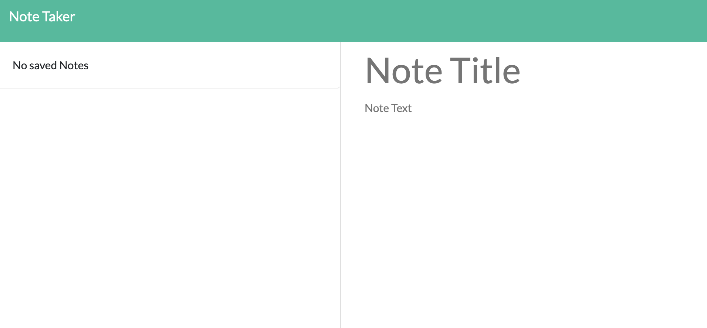
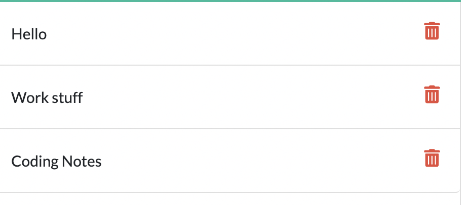

# Note Taker Project

## Table of Contents
            
- [Description](#Description)
- [Usage](#Usage)
- [Questions](#Questions)

### Description
For this project, I was tasked to finish an application that will allow the user to write notes and save them to a sidebar on the webpage. I was given a starter code that designed the webpage and had the vanilla javascript pre-written. To finished the code, I had to create the server Javascript and connect the two scripts together with the htmls. To setup the server, I downloaded and required the express npm and set up the PORT call and encoded the server. From there, I pulled in the htmls through some app gets and used an app use with express static to fix some pathing issues with the html and index server. I then used the app get and app post to push the user written notes to the db.json file and then pulled from the same file to display them on the sidebar.

After that, I pulled in the uuid npm to give each note a unique id that would allow me to delete them by targeting that id. For the app delete, I read the file and filtered them by their individual ids. Using this id, I targeted which one was clicked on and delete that note by its id. After deleting it, I then saved the deleted version to the db.json so that it will properly display.

### Usage
To use this application, you first need to click on the get started button and this will take you to the notes page. From there, you can start typing in the text area. To be able to save the note, you must have a title and content in the note. Once this criteria is met, you will see the save icon appear in the top right. Once saved, it will appear on the right in the sidebar. To view a certain note just click on its title. To create a new note while viewing a note click on the + button. To delete a note, press the trash can icon on the note you wish to delete.

Link to the deployed application: https://radiant-bayou-80016.herokuapp.com/

### Questions
My Github: https://github.com/morrisbianco

andrewbianco98@gmail.com: Please contact me through this E-mail address with any further questions that you may have.
            
